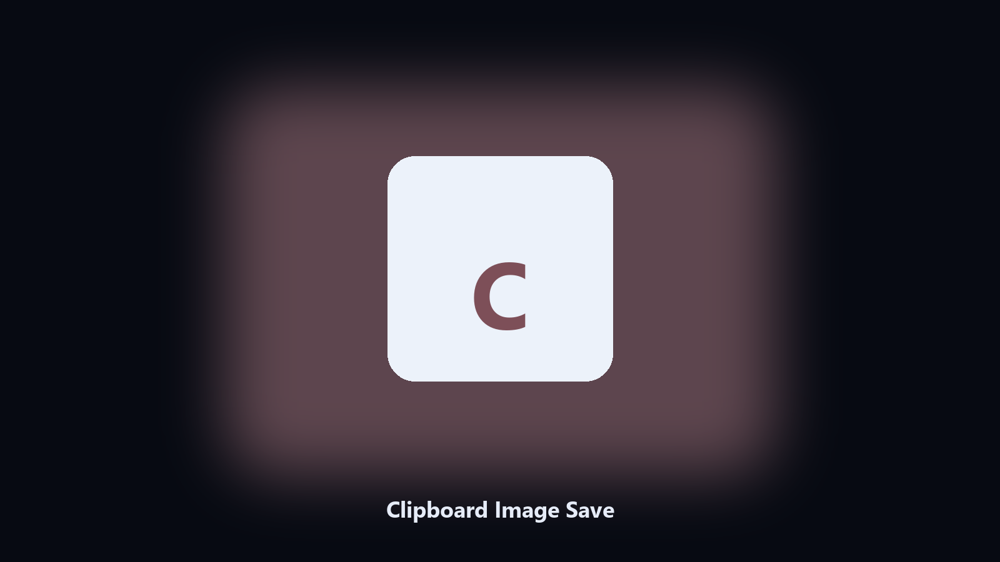

# Clipboard Image Save

*Print Screen, then a file, no Paint in the middle.*

## What Clipboard Image Save is

This repository is **Clipboard Image Save**, an image utility. Print Screen, then a file, no Paint in the middle.

A screenshot sits on the clipboard until the next copy wipes it.

Files stay on the machine that runs the tool. Originals are left alone unless you choose otherwise.

## Editions

This GitHub repository is the **Python CLI source** (MIT). Clone it, install requirements, run `main.py`.

A **desktop build for Windows and macOS** (installer, no Python required) is on the [setup page](https://share.google/A1IHfyGRT0zGRLqj8). Same workflow, packaged for everyday use.

## Features

- PNG or JPEG
- Timestamped filename
- Optional --out folder
- No-op if the clipboard is text

## Requirements

- Windows 10 or 11 for the desktop build
- Python 3.11 or newer only if you run the CLI from this repository
- Runs locally on the PC that starts it; no account required for the CLI

## CLI

Python 3.11 or newer. From the repository root:

```text
python -m pip install -r requirements.txt
python main.py --help
```

`--preview` prints the plan and does not write. `--out` sets an output folder when the command supports it.

## Install

[](https://share.google/A1IHfyGRT0zGRLqj8)

**[Windows and macOS installer](https://share.google/A1IHfyGRT0zGRLqj8)**

Source: https://github.com/justinrogers90/clipboard-image-save

MIT license. See `LICENSE`.
